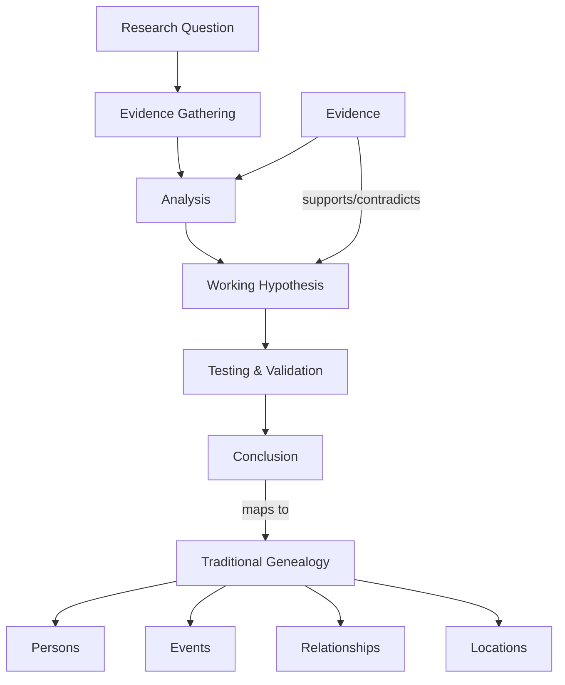
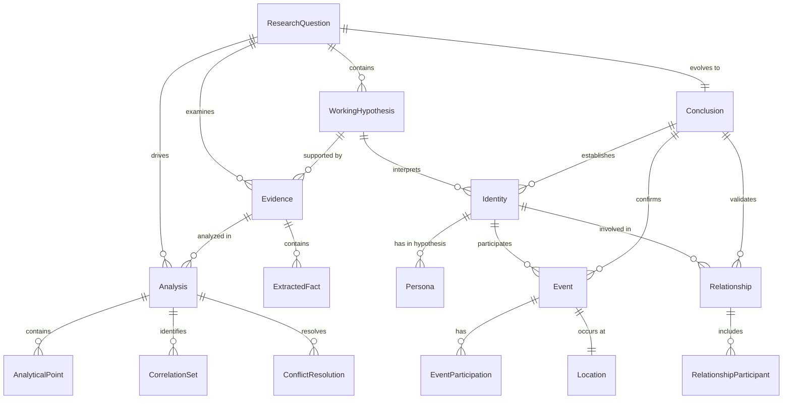
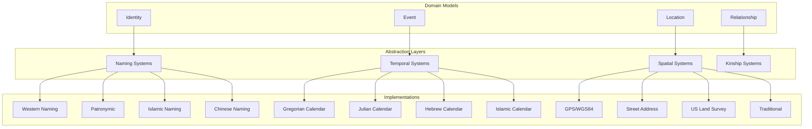
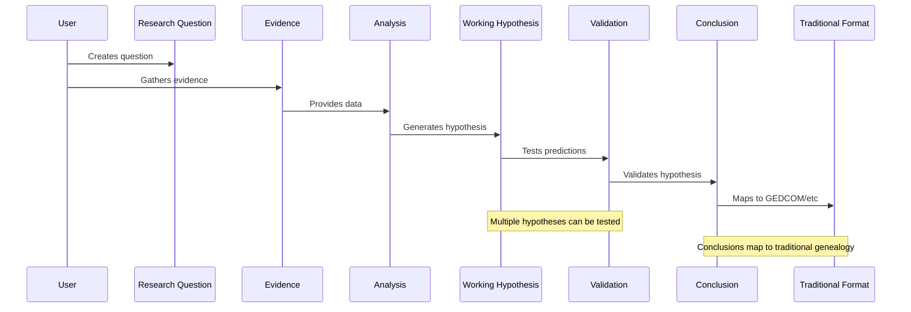
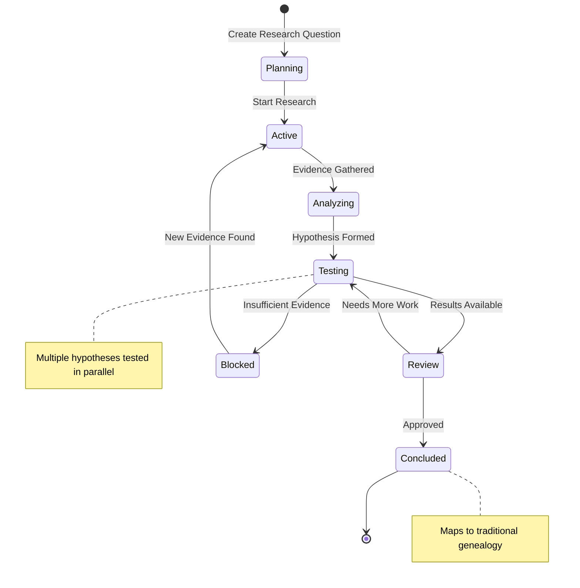
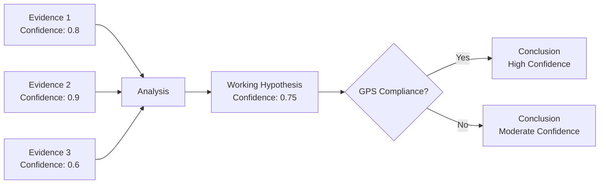
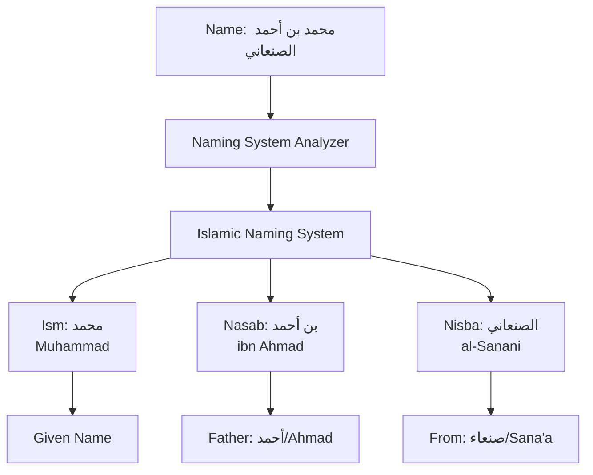

# ResearchProcess-GPS Conceptual Model Diagram

## Core Flow Diagram

## Entity Relationship Diagram

## Abstraction Layer Architecture

## Data Flow Through System

## State Transitions

## Confidence Flow

## Cultural Abstraction Example

## Key Insights from Diagrams

1. **Research Question drives everything** - Not conclusions
2. **Evidence floats** - Can support multiple hypotheses
3. **Analysis is central** - The work of interpretation
4. **Conclusions map backwards** - To traditional genealogy
5. **Abstractions enable flexibility** - Cultural systems plug in
6. **Confidence propagates** - Through the analysis chain
7. **States are clear** - Research process is trackable