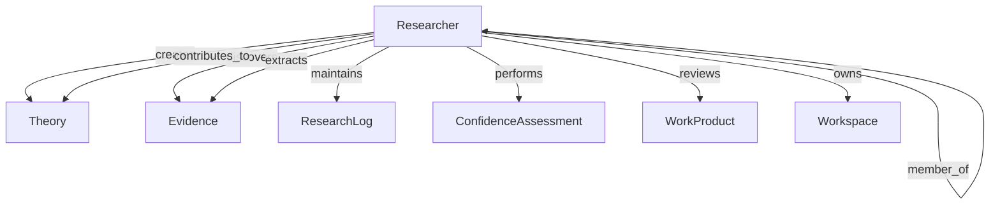
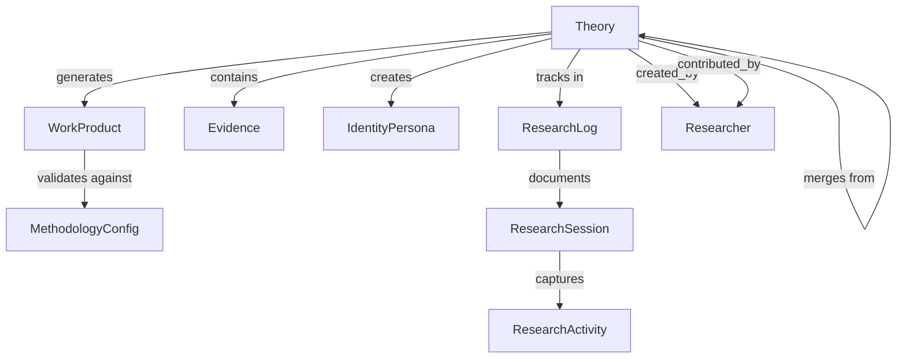
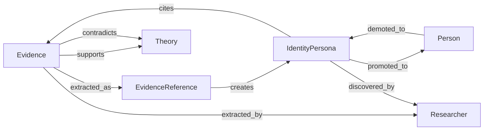
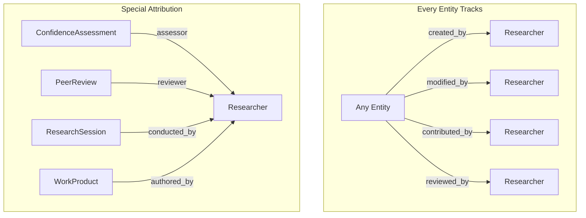
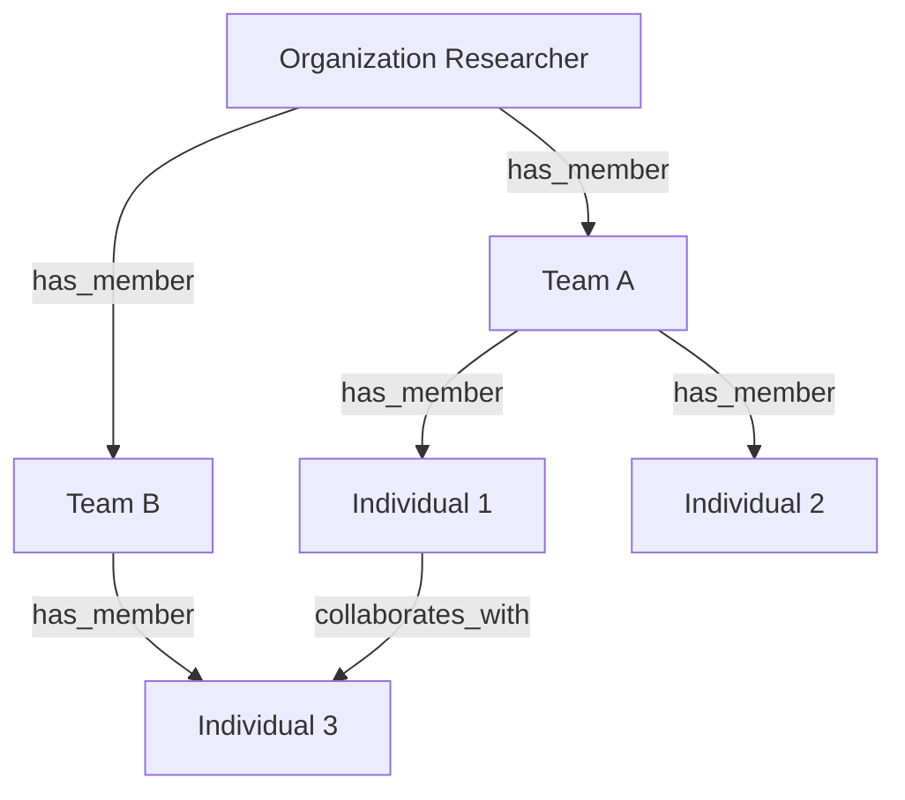

# Entity Relationship Refinement - ResearchProcess-GPS
## 2025-07-30 21:00 EEST
## Updated: 2025-07-30 21:20 EEST with Researcher entity

## Core Entity Relationships

### 1. Researcher (Top-Level Attribution Entity)



**Key Relationships:**
- **Researcher → Theory**: One-to-many as creator, many-to-many as contributors
- **Researcher → Evidence**: One-to-many for discovery and extraction
- **Researcher → Researcher**: Self-referential for teams and organizations
- **Researcher → WorkProduct**: Many-to-many through creation and review
- **Researcher → Workspace**: One-to-many ownership, many-to-many access

### 2. Theory (Research Question) Relationships



**Key Relationships:**
- **Theory → WorkProduct**: One-to-many. A theory generates multiple work products
- **Theory → Evidence**: Many-to-many through EvidenceReference
- **Theory → IdentityPersona**: One-to-many. Identities discovered during research
- **Theory → Theory**: Self-referential for branching/merging
- **Theory → Researcher**: Many-to-one creator, many-to-many contributors

### 3. Evidence ↔ IdentityPersona Linkage



**Evidence Reference Pattern:**
```python
class EvidenceReference:
    """Links evidence to extracted information"""
    evidence_id: UUID
    extracted_type: str  # "name", "date", "place", "relationship"
    extracted_value: Any
    interpretation_notes: str
    confidence: float
    
    # Attribution
    extracted_by: UUID  # Researcher ID
    extraction_date: datetime
    
    # Creates or updates
    target_entity: Optional[UUID]  # IdentityPersona, Event, etc.
    target_type: str
```

### 4. Attribution Throughout System



### 5. Researcher Hierarchies and Teams



**Nesting Pattern:**
```python
# Organization level
org = Researcher(
    name="Smith Genealogy Research LLC",
    researcher_type=ResearcherType.ORGANIZATION
)

# Team level
team = Researcher(
    name="Irish Research Team",
    researcher_type=ResearcherType.TEAM,
    parent_researcher=org.id
)

# Individual level
individual = Researcher(
    name="Jane Smith, CG",
    researcher_type=ResearcherType.INDIVIDUAL,
    parent_researcher=team.id
)
```

## Updated Entity Relationships

### Primary Relationships with Attribution
| From | To | Cardinality | Attribution |
|------|-----|------------|-------------|
| Researcher | Theory | 1:N (creates) | created_by |
| Researcher | Theory | N:M (contributes) | contributors |
| Researcher | Evidence | 1:N (discovers) | extracted_by |
| Researcher | IdentityPersona | 1:N (discovers) | discovered_by |
| Researcher | Person | 1:N (concludes) | concluded_by |
| Researcher | WorkProduct | 1:N (creates) | created_by |
| Researcher | ConfidenceAssessment | 1:N | assessor_id |
| Researcher | Workspace | 1:N (owns) | owner_id |
| Researcher | Researcher | N:1 (member of) | parent_researcher |

### Process Relationships with Attribution
| From | To | Cardinality | Attribution |
|------|-----|------------|-------------|
| ResearchLog | Researcher | N:1 | maintained_by |
| ResearchSession | Researcher | N:1 | researcher_id |
| ResearchActivity | Researcher | N:1 | performed_by |
| WorkProductReview | Researcher | N:1 | reviewer_id |
| AuditCheckItem | Researcher | N:1 | completed_by_id |

## Permission Model

```python
class ResearcherPermissions:
    """How researchers interact with entities"""
    
    # Entity-level permissions
    entity_permissions = {
        "Theory": {
            "create": [RESEARCHER, LEAD_RESEARCHER, ADMIN],
            "modify": [OWNER, LEAD_RESEARCHER, ADMIN],
            "delete": [OWNER, ADMIN],
            "read": [ALL]
        },
        "Person": {
            "create": [LEAD_RESEARCHER, ADMIN],  # More restricted
            "modify": [OWNER, LEAD_RESEARCHER, ADMIN],
            "delete": [ADMIN],  # Very restricted
            "read": [ALL]
        },
        "Evidence": {
            "create": [CONTRIBUTOR, RESEARCHER, LEAD_RESEARCHER, ADMIN],
            "modify": [OWNER, RESEARCHER, LEAD_RESEARCHER, ADMIN],
            "delete": [OWNER, LEAD_RESEARCHER, ADMIN],
            "read": [ALL]
        }
    }
    
    # Workspace-level permissions
    workspace_permissions = {
        "OWNER": ["ALL"],
        "ADMIN": ["ALL except delete workspace"],
        "CONTRIBUTOR": ["create", "modify own", "read"],
        "REVIEWER": ["read", "review", "comment"],
        "OBSERVER": ["read"]
    }
```

## Activity Tracking

```python
class ResearcherActivity:
    """Track all researcher activities"""
    
    activity_types = [
        "theory_created",
        "theory_modified",
        "evidence_discovered",
        "evidence_analyzed",
        "identity_created",
        "person_concluded",
        "assessment_performed",
        "review_submitted",
        "work_product_created",
        "session_started",
        "session_completed"
    ]
    
    def log_activity(researcher_id: UUID, 
                    activity_type: str,
                    entity_id: UUID,
                    entity_type: str,
                    details: Dict[str, Any]) -> None:
        """Log researcher activity for metrics and audit"""
        pass
```

## Collaboration Patterns

### 1. Team Research
```python
# Multiple researchers on one theory
theory.created_by = lead_researcher.id
theory.contributors = [researcher1.id, researcher2.id]

# Each contribution tracked
for evidence in evidences:
    evidence.extracted_by = researcher_who_found_it.id
    evidence.verified_by = reviewer.id
```

### 2. Peer Review
```python
# Work product review
review = WorkProductReview(
    reviewer_id=peer_researcher.id,
    reviewer_name=peer_researcher.get_display_name(),
    review_type="methodology",
    approval_status="conditional"
)

# Confidence assessment review
confidence.peer_reviewer_ids.append(reviewer.id)
```

### 3. Attribution Display
```python
def get_attribution_display(entity: Any) -> str:
    """Generate attribution text for display"""
    creator = get_researcher(entity.created_by)
    
    text = f"Created by {creator.get_display_name()}"
    if creator.get_credentials_display():
        text += f" ({creator.get_credentials_display()})"
    
    if hasattr(entity, 'contributors') and entity.contributors:
        contrib_names = [get_researcher(id).get_display_name() 
                        for id in entity.contributors[:3]]
        text += f", with contributions from {', '.join(contrib_names)}"
        if len(entity.contributors) > 3:
            text += f" and {len(entity.contributors) - 3} others"
    
    return text
```

## Privacy and Display Considerations

```python
class ResearcherPrivacy:
    """Handle researcher privacy preferences"""
    
    def get_public_attribution(researcher: Researcher) -> Dict:
        """Get attribution info respecting privacy"""
        if not researcher.privacy_settings.get('show_real_name', True):
            # Use identifier or anonymous
            return {
                'id': researcher.id,
                'display_name': f"Researcher {str(researcher.id)[:8]}",
                'credentials': ""
            }
        
        return {
            'id': researcher.id,
            'display_name': researcher.name,
            'credentials': researcher.get_credentials_display()
                          if researcher.privacy_settings.get('show_credentials', True)
                          else ""
        }
```

## Next Steps

1. Update all entity constructors to require researcher_id
2. Add attribution display methods to all entities
3. Implement activity logging throughout
4. Design permission checking middleware
5. Create researcher management UI concepts
6. Define team collaboration workflows