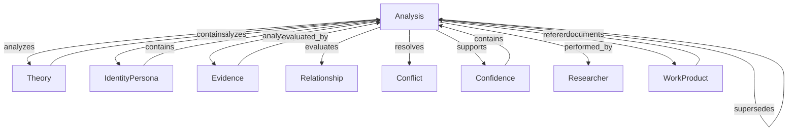
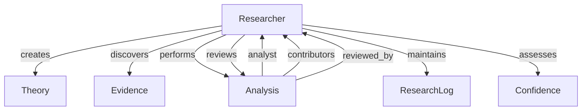
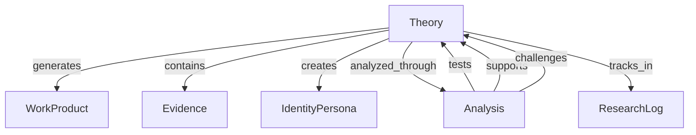
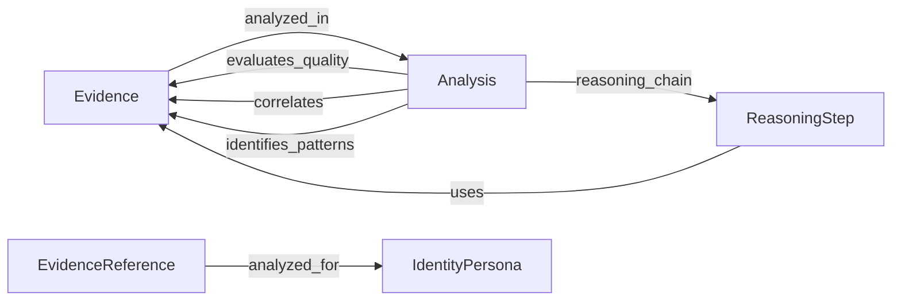
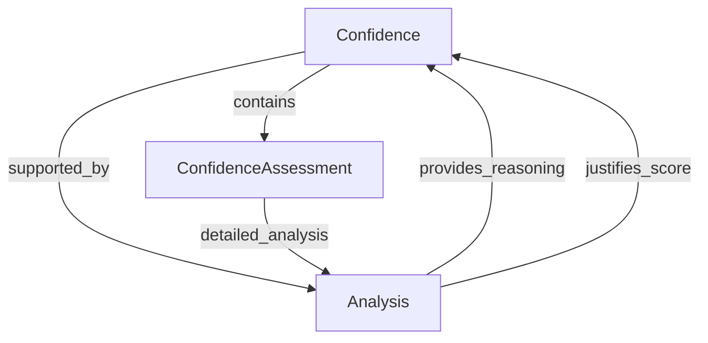
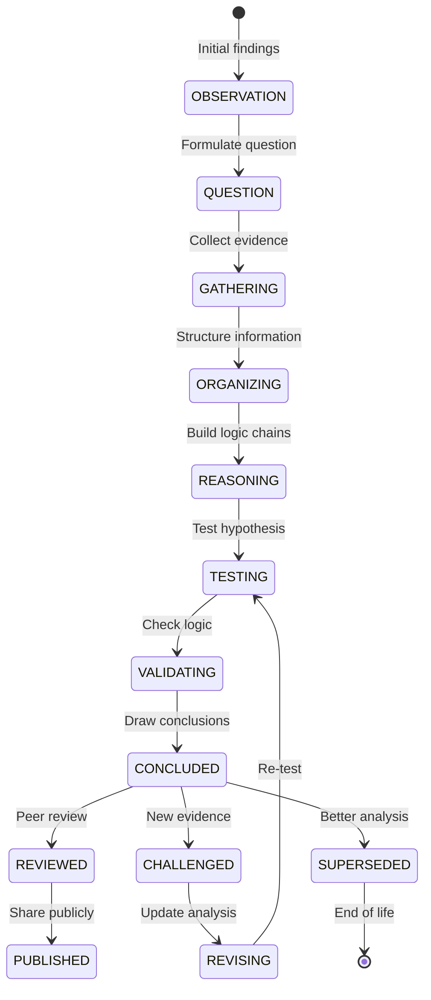

# Entity Relationship Refinement with Analysis - ResearchProcess-GPS
## 2025-07-31 (Updated from 2025-07-30)

## Core Entity Relationships Including Analysis

### 1. Analysis (NEW - Central Analytical Entity)



**Key Relationships:**
- **Analysis → Any Entity**: Many-to-many for analyzing entities
- **Analysis → Researcher**: Many-to-one for analyst, many-to-many for contributors
- **Analysis → Analysis**: Self-referential for alternatives and superseding
- **Analysis ↔ Confidence**: Can be nested within or support confidence
- **Analysis ↔ WorkProduct**: Bidirectional reference

### 2. Researcher with Analysis



### 3. Theory with Analysis



### 4. Evidence ↔ Analysis Linkage



### 5. Confidence Enhanced with Analysis



## Updated Entity Relationships Table

### Primary Relationships with Analysis
| From | To | Cardinality | Purpose |
|------|-----|------------|---------|
| Analysis | Theory | N:1 | Analyzes research question |
| Analysis | IdentityPersona | N:M | Analyzes identities |
| Analysis | Evidence | N:M | Evaluates evidence |
| Analysis | Confidence | N:1 | Supports confidence assessment |
| Analysis | WorkProduct | N:M | Documents analytical work |
| Analysis | Researcher | N:1 | Primary analyst |
| Analysis | Researcher | N:M | Contributors/reviewers |
| Analysis | Analysis | N:M | Alternatives/superseding |

### Nesting Relationships
| Parent | Child | Purpose |
|--------|-------|---------|
| Confidence | Analysis | Detailed reasoning for confidence |
| IdentityPersona | Analysis | Identity-specific analyses |
| Theory | Analysis | Theory-level analyses |
| Evidence | Analysis | Evidence quality assessment |

### Process Relationships with Analysis
| From | To | Cardinality | Purpose |
|------|-----|------------|---------|
| ResearchLog | Analysis | 1:N | Documents analyses performed |
| ResearchSession | Analysis | 1:N | Analyses during session |
| ResearchActivity | Analysis | 1:1 | Analysis as activity |
| WorkProduct | Analysis | N:M | Formal documentation |

## Analysis Integration Patterns

### 1. Identity Resolution Pattern
```python
# Multiple personas analyzed for same-person determination
analysis = Analysis(
    analysis_type=AnalysisType.IDENTITY_RESOLUTION,
    scope={
        "entities": [persona1_id, persona2_id],
        "question": "Are these the same person?"
    }
)

# Reasoning chain
analysis.add_reasoning_step(
    observation="Both appear in same location 1850-1860",
    reasoning="Geographic proximity suggests possibility",
    conclusion="Consistent with same-person hypothesis",
    evidence_refs=[census_1850, census_1860]
)

# Nested in persona
persona1.identity_analyses.append(analysis)
```

### 2. Conflict Resolution Pattern
```python
# Conflicting evidence analyzed
conflict_analysis = Analysis(
    analysis_type=AnalysisType.CONFLICT_RESOLUTION,
    scope={
        "entities": [evidence1_id, evidence2_id],
        "question": "Birth year 1825 vs 1827?"
    }
)

# Nested in confidence
confidence.supporting_analyses.append(conflict_analysis)
```

### 3. Family Reconstruction Pattern
```python
# Complex multi-person analysis
family_analysis = Analysis(
    analysis_type=AnalysisType.FAMILY_RECONSTRUCTION,
    scope={
        "entities": persona_ids,
        "question": "Smith family structure 1850-1880",
        "geographic_scope": ["Boise, Idaho"]
    }
)

# Standalone, referenced by theory
theory.analyses.append(family_analysis.id)
```

## Analysis State Transitions



## Analysis Attribution Model

```python
class AnalysisAttribution:
    """How researchers interact with analyses"""
    
    # Primary roles
    analyst: UUID  # Main researcher conducting analysis
    contributors: List[UUID]  # Supporting researchers
    reviewers: List[UUID]  # Peer reviewers
    
    # Activity tracking
    created_date: datetime
    last_modified_date: datetime
    modification_history: List[ModificationRecord]
    
    # Review tracking
    reviews: List[AnalysisReview]
    validation_status: str
    
    # Time tracking
    time_invested: float  # Hours
    research_sessions: List[UUID]
```

## Analysis Method Configuration

```yaml
AnalysisMethodConfigurations:
  FAN_PRINCIPLE:
    required_elements:
      - identify_cluster_members
      - map_relationships
      - analyze_interactions
      - geographic_proximity
    tools:
      - relationship_chart
      - timeline
      - map_plot
    validation_rules:
      - minimum_cluster_size: 3
      - relationship_types: ["family", "business", "social"]
      
  EVIDENCE_ANALYSIS:
    required_elements:
      - source_criticism
      - information_quality
      - evidence_classification
    tools:
      - quality_matrix
      - correlation_chart
    standards:
      - GPS_element_3
      - Evidence_Explained_principles
```

## Key Design Decisions

### 1. Analysis as Optional First-Class Entity
- Not every research action needs formal analysis
- Available for complex reasoning when needed
- Can be as simple or detailed as required

### 2. Flexible Placement
- Standalone for major conclusions
- Nested for supporting reasoning
- Referenced for documentation

### 3. Reasoning Chain Capture
- Step-by-step logic preserved
- Alternative interpretations documented
- Confidence at each step

### 4. Evolution and Superseding
- Analyses can be updated
- New analyses can supersede old
- History preserved throughout

### 5. Peer Review Integration
- Built-in review mechanism
- Confidence adjustments
- Validation tracking

This enhanced relationship model with Analysis provides the missing link between evidence and conclusions, capturing the "how" and "why" of genealogical reasoning.