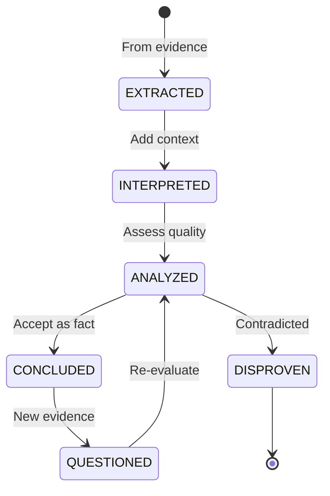

# Facts, Events, and Attributes Model - ResearchProcess-GPS
## 2025-07-30 21:50 EEST

## Overview

Based on BetterGEDCOM analysis and GEDCOM X patterns, ResearchProcess-GPS adopts a unified **Fact** model that encompasses events, attributes, and characteristics. This provides maximum flexibility while maintaining clarity.

## Core Concept: Everything is a Fact

### Unification Principle
```
Traditional:
- Event: Something that happened (Birth, Marriage)
- Attribute: A characteristic (Occupation, Religion)
- Property: A quality (Height, Hair Color)

ResearchProcess-GPS:
- Fact: Any assertion about an entity, whether event or characteristic
```

## Fact Entity Model

```python
@dataclass
class Fact(NestableBaseEntity['Fact']):
    """
    Unified model for events, attributes, and characteristics.
    Can represent both evidence extractions and conclusions.
    Supports nesting for compound facts.
    """
    
    # Fact classification
    fact_class: FactClass  # EVENT, ATTRIBUTE, CHARACTERISTIC, RELATIONSHIP
    fact_type: str         # Extensible: "birth", "death", "occupation", "residence"
    
    # The fact subject(s)
    primary_subject: Optional[UUID] = None  # IdentityPersona or Person
    subjects: List[UUID] = field(default_factory=list)  # For multi-person facts
    
    # Temporal aspect
    date: Optional[TemporalDescription] = None
    date_confidence: Optional[Confidence] = None
    
    # Spatial aspect
    place: Optional[PlaceReference] = None
    place_confidence: Optional[Confidence] = None
    
    # Value (for non-event facts)
    value: Optional[str] = None
    value_confidence: Optional[Confidence] = None
    
    # Participants (for events)
    participants: List[FactParticipant] = field(default_factory=list)
    
    # Evidence basis
    evidence_references: List[EvidenceReference] = field(default_factory=list)
    
    # Overall confidence
    confidence: Confidence  # Full container with assessments
    
    # State tracking
    state: FactState = FactState.EXTRACTED
    # EXTRACTED → INTERPRETED → ANALYZED → CONCLUDED → QUESTIONED
    
    # For compound/complex facts
    component_facts: List[UUID] = field(default_factory=list)  # Nested facts
    
    # Attribution
    extracted_by: UUID  # Researcher ID
    extraction_date: datetime
    interpretation_notes: Optional[str] = None
    
    # Qualifiers (additional context)
    qualifiers: Dict[str, Any] = field(default_factory=dict)
    # Examples:
    # {"cause": "pneumonia"} for death event
    # {"military_branch": "Army"} for military service
    
    # Validation against vocabulary
    vocabulary_uri: Optional[str] = None  # References fact type definition
```

### Supporting Types

```python
class FactClass(Enum):
    """High-level fact classification"""
    EVENT = "event"              # Something that happened
    ATTRIBUTE = "attribute"      # A characteristic
    CHARACTERISTIC = "characteristic"  # A quality
    RELATIONSHIP = "relationship"      # Assertion about relationship

class FactState(Enum):
    """Fact lifecycle states"""
    EXTRACTED = "extracted"      # Raw extraction from evidence
    INTERPRETED = "interpreted"  # Context added
    ANALYZED = "analyzed"       # Quality assessed
    CONCLUDED = "concluded"     # Accepted as conclusion
    QUESTIONED = "questioned"   # Under review
    DISPROVEN = "disproven"    # Contradicted by evidence

@dataclass
class FactParticipant:
    """Participant in a fact (primarily for events)"""
    participant_id: UUID         # IdentityPersona or Person
    participant_type: str        # "identity" or "person"
    
    role: str                   # Extensible: "principal", "witness", "officiant"
    role_vocabulary_uri: Optional[str] = None
    
    role_confidence: Optional[Confidence] = None
    
    # Participant-specific qualifiers
    qualifiers: Dict[str, Any] = field(default_factory=dict)
    # {"age": "infant"} for baptism
    # {"relationship": "mother"} for birth witness
    
    notes: Optional[str] = None

@dataclass
class TemporalDescription:
    """Flexible temporal representation"""
    original_text: str          # "about 1850", "before 1823"
    
    # Normalized representations
    iso_date: Optional[str] = None      # ISO 8601 if possible
    julian_day: Optional[int] = None    # For calculations
    
    # Components
    year: Optional[int] = None
    month: Optional[int] = None
    day: Optional[int] = None
    
    # Precision and modifiers
    precision: TemporalPrecision = TemporalPrecision.DAY
    modifier: Optional[TemporalModifier] = None  # ABOUT, BEFORE, AFTER
    
    # Range support
    is_range: bool = False
    end_date: Optional['TemporalDescription'] = None
    
    # Calendar system
    calendar: str = "gregorian"

@dataclass
class PlaceReference:
    """Reference to a place"""
    place_id: Optional[UUID] = None      # Link to Place entity
    
    # Original text
    original_text: str                   # "Boston, Suffolk, Mass."
    
    # Normalized components
    components: List[PlaceComponent] = field(default_factory=list)
    
    # Coordinates if known
    latitude: Optional[float] = None
    longitude: Optional[float] = None
    
    # Temporal jurisdiction
    jurisdiction_date: Optional[datetime] = None
```

## Extensible Fact Vocabularies

### Configuration Structure
```yaml
# config/vocabularies/standard_facts.yaml
vocabulary:
  uri: "https://researchprocess-gps.org/vocabularies/facts/v1"
  version: "1.0"
  
fact_types:
  # Events
  birth:
    class: EVENT
    description: "The birth of a person"
    requires_date: true
    requires_place: true
    standard_roles:
      - principal: "The person being born"
      - mother: "Biological mother"
      - father: "Biological father"
      - witness: "Person who witnessed birth"
      - informant: "Person who reported birth"
    standard_qualifiers:
      - stillborn: "boolean"
      - multiple_birth: "string"  # "twin", "triplet"
      
  death:
    class: EVENT
    description: "The death of a person"
    requires_date: true
    requires_place: true
    standard_roles:
      - principal: "The deceased"
      - informant: "Person who reported death"
      - witness: "Person present at death"
    standard_qualifiers:
      - cause: "string"
      - age_at_death: "string"
      
  marriage:
    class: EVENT
    description: "A marriage event"
    requires_date: true
    requires_place: true
    minimum_participants: 2
    standard_roles:
      - groom: "Male partner"
      - bride: "Female partner"
      - spouse: "Gender-neutral partner"
      - witness: "Marriage witness"
      - officiant: "Person performing ceremony"
      
  # Attributes
  occupation:
    class: ATTRIBUTE
    description: "A person's occupation"
    has_value: true
    temporal: true  # Can change over time
    standard_qualifiers:
      - employer: "string"
      - industry: "string"
      
  residence:
    class: ATTRIBUTE
    description: "Where a person lived"
    requires_place: true
    temporal: true
    standard_qualifiers:
      - dwelling_type: "string"  # "house", "apartment"
      - ownership: "string"      # "owned", "rented"
      
  # Characteristics
  physical_description:
    class: CHARACTERISTIC
    description: "Physical characteristics"
    has_value: true
    standard_qualifiers:
      - height: "string"
      - weight: "string"
      - hair_color: "string"
      - eye_color: "string"
```

### Custom Facts Support
```yaml
# config/vocabularies/custom_facts.yaml
custom_namespace: "user.custom"

custom_facts:
  dna_test:
    class: EVENT
    description: "DNA test taken"
    standard_roles:
      - test_subject: "Person tested"
    standard_qualifiers:
      - test_type: "string"  # "Y-DNA", "mtDNA", "autosomal"
      - test_company: "string"
      - kit_number: "string"
      
  immigration_status:
    class: ATTRIBUTE
    description: "Immigration/citizenship status"
    has_value: true
    temporal: true
    standard_qualifiers:
      - document_type: "string"
      - document_number: "string"
```

## Integration with Core Model

### 1. Facts Link to IdentityPersona/Person
```python
# Facts discovered create or enhance identities
identity = IdentityPersona(
    evidence_references=[birth_evidence_ref],
    state=IdentityState.WORKING
)

birth_fact = Fact(
    fact_class=FactClass.EVENT,
    fact_type="birth",
    primary_subject=identity.id,
    date=TemporalDescription(original_text="abt 1850"),
    place=PlaceReference(original_text="Boston, Mass"),
    evidence_references=[birth_evidence_ref]
)
```

### 2. Facts Can Nest
```python
# Military service as compound fact
military_service = Fact(
    fact_class=FactClass.ATTRIBUTE,
    fact_type="military_service",
    primary_subject=person.id,
    date=TemporalDescription(original_text="1861-1865")
)

enlistment = Fact(
    fact_class=FactClass.EVENT,
    fact_type="military_enlistment",
    primary_subject=person.id,
    date=TemporalDescription(iso_date="1861-04-15"),
    parent=military_service.id
)

discharge = Fact(
    fact_class=FactClass.EVENT,
    fact_type="military_discharge",
    primary_subject=person.id,
    date=TemporalDescription(iso_date="1865-06-10"),
    parent=military_service.id
)
```

### 3. Multi-Person Facts
```python
# Marriage involves multiple people
marriage = Fact(
    fact_class=FactClass.EVENT,
    fact_type="marriage",
    subjects=[groom_id, bride_id],
    participants=[
        FactParticipant(
            participant_id=groom_id,
            role="groom"
        ),
        FactParticipant(
            participant_id=bride_id,
            role="bride"
        ),
        FactParticipant(
            participant_id=witness1_id,
            role="witness"
        )
    ]
)
```

## State Transitions



## Benefits of This Model

1. **Unified Handling**: Events and attributes use same infrastructure
2. **Maximum Flexibility**: Everything extensible through vocabularies
3. **Evidence-Based**: Every fact traces to evidence
4. **Multi-Dimensional Confidence**: Separate confidence for date, place, value
5. **Collaboration Ready**: Full attribution tracking
6. **Standards Compliant**: Maps to GEDCOM X, GEDCOM 7, etc.
7. **Research Process**: States track fact lifecycle
8. **Cultural Adaptability**: Vocabularies can be culture-specific

## Next Steps

1. Implement Fact entity with state management
2. Create vocabulary loading system
3. Design fact validation against vocabularies
4. Build fact-to-identity linkage
5. Implement compound fact nesting
6. Create fact merge/split operations